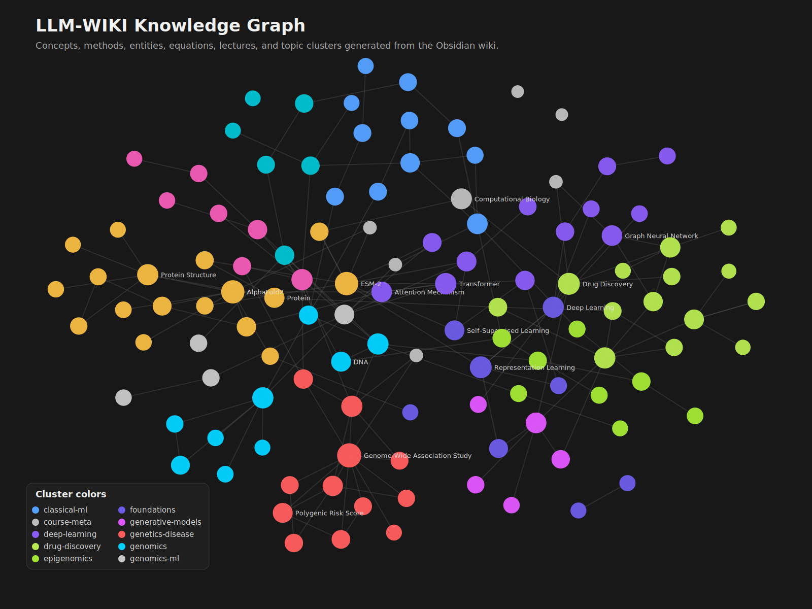

# LLM-WIKI

LLM-WIKI is an Obsidian-style knowledge graph and retrieval chatbot for computational biology lecture material. It converts lecture notes, source material, concepts, entities, methods, equations, and comparisons into a structured Markdown wiki that can be searched by an LLM-backed chat interface.

The project has three main parts:

- `llm-wiki/`: the Markdown knowledge graph, Obsidian vault, graph-repair scripts, retrieval files, and wiki quality tools.
- `backend/`: a FastAPI RAG server that searches the wiki and exposes OpenAI-compatible chat endpoints.
- `frontend/`: a Next.js chat UI adapted from Chatbot UI with a no-auth LLM Wiki chat page.

## Knowledge Graph Preview

Click the graph image to open the full-size SVG and zoom into the LLM-WIKI concept network.

<a href="docs/assets/llm-wiki-graph.svg">
  
</a>

## What This Project Does

This repo is designed to make computational biology lecture knowledge easier to browse, connect, and query.

It supports:

- Obsidian graph exploration of computational biology concepts.
- Canonical lecture, concept, method, entity, equation, comparison, and topic notes.
- Wiki scoring, duplicate detection, orphan repair, graph indexing, and link validation scripts.
- A FastAPI backend that retrieves relevant wiki chunks.
- A Next.js frontend chat page that asks questions against the wiki.
- OpenAI-compatible `/v1/chat/completions` API behavior for easier integration with chat clients.

## How The Frontend And Backend Connect

The frontend runs in the browser on port `3000`.

```text
http://localhost:3000
```

The backend runs as a Python FastAPI server on port `8000`.

```text
http://127.0.0.1:8000
```

When a user sends a chat message:

```text
Browser chat page
  -> POST /api/chat/llm-wiki
  -> Next.js API route
  -> POST http://127.0.0.1:8000/v1/chat/completions
  -> FastAPI retrieves wiki context
  -> LLM generates answer
  -> Response streams back to the UI
```

Important files:

- `frontend/app/[locale]/llm-wiki/page.tsx`: the no-auth LLM Wiki chat screen.
- `frontend/app/api/chat/llm-wiki/route.ts`: frontend API proxy to the backend.
- `backend/app.py`: FastAPI app, retrieval logic, and chat endpoints.
- `llm-wiki/retrieval/`: prebuilt retrieval chunks and graph indexes.

## Run Locally

### 1. Start The Backend

```powershell
cd D:\pythonProject\GEN-AI\Build-LLM-WIKI\backend
$env:LLM_WIKI_ROOT="D:\pythonProject\GEN-AI\Build-LLM-WIKI\llm-wiki"
uv run python app.py
```

Health check:

```powershell
Invoke-RestMethod http://127.0.0.1:8000/health
```

### 2. Start The Frontend

```powershell
cd D:\pythonProject\GEN-AI\Build-LLM-WIKI\frontend
npm install
npm run dev
```

Open:

```text
http://localhost:3000/en/llm-wiki
```

## Environment Variables

Backend:

```env
LLM_WIKI_ROOT=../llm-wiki
MODEL_NAME=gpt-4.1-mini
OPENAI_API_KEY=your_key_here
```

Frontend:

```env
LLM_WIKI_API_BASE_URL=http://127.0.0.1:8000
NEXT_PUBLIC_LLM_WIKI_API_BASE_URL=http://127.0.0.1:8000
```

The full stock Chatbot UI workflow requires Supabase:

```env
NEXT_PUBLIC_SUPABASE_URL=
NEXT_PUBLIC_SUPABASE_ANON_KEY=
SUPABASE_SERVICE_ROLE_KEY=
```

The LLM Wiki chat page does not require Supabase.

## API Endpoints

Backend endpoints:

```text
GET  /
GET  /health
GET  /v1/models
POST /chat
POST /v1/chat/completions
POST /admin/reload
```

Example chat request:

```json
{
  "model": "llm-wiki",
  "messages": [
    {
      "role": "user",
      "content": "What is a Hidden Markov Model?"
    }
  ],
  "top_k": 6,
  "stream": true
}
```

## Wiki Graph Tools

Useful scripts live in `llm-wiki/scripts/`:

```powershell
cd D:\pythonProject\GEN-AI\Build-LLM-WIKI\llm-wiki
python scripts/wiki_score.py --json
python scripts/validate_links.py
python scripts/dedupe_nodes.py --check
python scripts/retrieval_eval.py
python scripts/build_graph_index.py
```

These scripts help measure graph quality, duplicate notes, broken links, retrieval quality, and schema consistency.

## Project Structure

```text
LLM-WIKI/
  backend/
    app.py
    pyproject.toml
    Dockerfile

  frontend/
    app/[locale]/llm-wiki/page.tsx
    app/api/chat/llm-wiki/route.ts
    package.json

  llm-wiki/
    Wiki/
    Raw/
    Schema/
    Comparisons/
    retrieval/
    scripts/
    .obsidian/
```

## Attribution And Citations

This project is an educational knowledge-wiki and chatbot project built around computational biology lecture material associated with Professor Manolis Kellis and computational biology topics such as genomics, epigenomics, sequence alignment, single-cell analysis, protein structure, language models for biology, drug discovery, and disease genetics.

Please cite the original teaching source and professor when using or extending the wiki content:

- Manolis Kellis, MIT Computational Biology. Course and teaching materials are associated with MIT computational biology instruction, including Algorithms for Computational Biology and related computational biology lectures. See the MIT course page for 6.096 Algorithms for Computational Biology: https://web.mit.edu/manoli/www/6.096/
- Manolis Kellis, Computational Biology: Genomes, Networks, Evolution course notes: https://compbio.mit.edu/teaching/book.pdf

The frontend is adapted from the open-source Chatbot UI project:

- Chatbot UI by Mckay Wrigley: https://github.com/mckaywrigley/chatbot-ui

This repository is not an official MIT project and is not endorsed by MIT, Professor Kellis, or the Chatbot UI maintainers. It is a student/developer project for learning, retrieval, graph organization, and RAG experimentation.

## Notes

- Do not commit real `.env` files or API keys.
- Raw lecture/source files are treated as source-of-truth.
- Generated logs and local assistant scratch folders are ignored.
- Prefer improving the wiki through small, scored graph-quality changes rather than large unvalidated rewrites.
